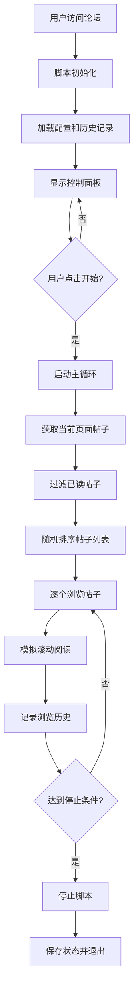

# 🤖 论坛自动阅读助手 | Community Automatic Reading

<div align="center">


**✨ 智能刷帖 · 避免重复 · 完全可配置 · 开源免费 ✨**

[🚀 快速安装](#-一键安装) | [📖 使用教程](#-详细使用教程) | [🔧 原理详解](#-技术原理详解) | [🌟 特色功能](#-特色功能)

</div>

## 📋 目录
- [🎯 项目简介](#-项目简介)
- [🚀 一键安装](#-一键安装)
- [📖 详细使用教程](#-详细使用教程)
- [🔧 技术原理详解](#-技术原理详解)
- [🌟 特色功能](#-特色功能)
- [⚡ 核心优势](#-核心优势)
- [🔮 未来发展](#-未来发展)
- [📊 项目现状](#-项目现状)
- [🎯 适用场景](#-适用场景)
- [📁 项目结构](#-项目结构)
- [🔍 技术细节](#-技术细节)
- [🚧 待完善功能](#-待完善功能)
- [🛠️ 开发指南](#️-开发指南)
- [📄 开源协议](#-开源协议)

## 🎯 项目简介

> 💡 **「让阅读更智能，让时间更高效」**

这是一个专为论坛用户设计的**智能自动阅读脚本** 🧠，它能够模拟人类阅读行为，自动浏览论坛帖子，帮助用户提升活跃度，同时避免重复阅读相同内容。

### 🌈 设计理念
我们相信技术应该**服务于人**，而不是相反。这个项目致力于：
- 🕒 **节省时间** - 自动化重复性浏览任务
- 🧠 **智能学习** - 记忆已读内容，避免重复
- 🎨 **用户体验** - 精美直观的操作界面
- 🔧 **完全可控** - 所有参数都可自定义

## 🚀 一键安装

### 方法一：直接安装（推荐懒人版）🎯

<div align="center">

**👇 点击下方按钮快速安装 👇**

[](https://github.com/lza6/Community-Automatic-Reading/raw/main/forum-auto-reader.user.js)

*需要先安装 [Tampermonkey](https://www.tampermonkey.net/) 浏览器扩展*
</div>

### 方法二：手动安装 🛠️

1. **安装 Tampermonkey 扩展**
   - Chrome: [点击安装](https://chrome.google.com/webstore/detail/tampermonkey/dhdgffkkebhmkfjojejmpbldmpobfkfo)
   - Firefox: [点击安装](https://addons.mozilla.org/firefox/addon/tampermonkey/)
   - Edge: [点击安装](https://microsoftedge.microsoft.com/addons/detail/tampermonkey/iikmkjmpaadaobahmlepeloendneqfpa)

2. **安装用户脚本**
   - 点击上方安装链接，Tampermonkey 会自动识别并提示安装

3. **开始使用**
   - 访问支持的论坛网站，脚本会自动运行

## 📖 详细使用教程

### 🎮 界面操作指南

<div align="center">


</div>

#### 控制面板功能详解 🎛️

| 按钮/控件 | 功能说明 | 使用技巧 |
|---------|---------|---------|
| **🧩 论坛助手** | 面板标题，可拖动 | 长按拖动到任意位置 |
| **⚙️** | 设置开关 | 点击展开/收起详细设置 |
| **—** | 最小化 | 点击缩小为悬浮球 |
| **🕒 运行时间** | 显示本次运行时长 | 实时更新，方便掌握进度 |
| **👀 本次浏览** | 显示已浏览帖子数 | `当前数/最大数` 格式显示 |
| **⚙️ 当前状态** | 运行状态指示 | 🟢运行中 🟡暂停中 🔴已停止 |
| **▶️ 开始/🛑 停止** | 主控制按钮 | 绿色=开始，红色=停止 |
| **⏸ 暂停/▶️ 恢复** | 暂停控制 | 蓝色=暂停，绿色=恢复 |

#### 🎯 新手使用步骤

1. **首次使用配置** ⚙️
   ```
   📝 推荐设置：
   - 最大运行时长：30分钟 ⏰
   - 最大浏览帖子数：50篇 📚
   - 显示预览窗口：开启 👁️
   ```

2. **启动脚本** 🚀
   - 点击 **▶️ 开始** 按钮
   - 观察状态变为 **🟢 运行中**
   - 脚本会自动开始浏览帖子

3. **暂停与恢复** ⏸️
   - 临时有事？点击 **⏸ 暂停**
   - 回来后点击 **▶️ 恢复** 继续

4. **停止任务** 🛑
   - 完成任务后点击 **🛑 停止**
   - 或等待达到设置的限制自动停止

### ⚙️ 高级设置详解

| 设置项 | 作用 | 推荐值 | 技术原理 |
|-------|------|--------|----------|
| **最大运行时长** | 防止长时间运行 | 30-60分钟 | 基于时间戳计算运行时长 |
| **最大浏览帖子数** | 控制阅读数量 | 50-100篇 | 计数器机制，达到即停止 |
| **显示预览窗口** | 可视化浏览过程 | 开启 | iframe沙盒技术，安全隔离 |

## 🔧 技术原理详解

### 🧠 核心算法原理

```javascript
// 🎯 核心工作流程
1. 页面加载 → 初始化UI面板
2. 用户点击开始 → 启动主循环
3. 获取帖子列表 → 过滤已读内容
4. 随机排序 → 避免模式化
5. 逐个浏览 → 模拟阅读行为
6. 记录历史 → 更新已读列表
7. 检查停止条件 → 智能终止
```

### 🔄 工作流程图



### 🔍 关键技术解析

#### 1. **DOM内容解析** 🌐
```javascript
// 📍 帖子链接提取
const allTopics = [...document.querySelectorAll('#list-area a.title')]
  .filter(el => !el.closest('tr')?.querySelector('.pinned'))
  .map(el => ({ 
    title: el.textContent.trim(), 
    url: el.href 
  }));
```
- **技术点**: CSS选择器 + 数组操作
- **作用**: 精准定位帖子链接，排除置顶帖
- **难度**: ⭐⭐☆☆☆ (简单)

#### 2. **已读记录管理** 🗃️
```javascript
// 📊 智能历史记录管理
const MAX_HISTORY_SIZE = 1000;
let visitedTopics = GM_getValue('linuxdoVisitedTopics', []);

// 添加新记录，自动清理旧记录
visitedTopics.push(topic.url);
if (visitedTopics.length > MAX_HISTORY_SIZE) {
  visitedTopics.shift(); // FIFO队列
}
```
- **技术点**: 队列数据结构 + 本地存储
- **作用**: 防止内存溢出，保持性能
- **难度**: ⭐⭐⭐☆☆ (中等)

#### 3. **随机化算法** 🎲
```javascript
// 🔀 费雪-耶茨洗牌算法
const shuffle = arr => arr.sort(() => Math.random() - 0.5);
const topicsToBrowse = shuffle(unreadTopics);
```
- **技术点**: 随机排序算法
- **作用**: 避免固定浏览模式，更显自然
- **难度**: ⭐⭐☆☆☆ (简单)

#### 4. **沙盒预览技术** 🏗️
```javascript
// 🛡️ 安全的iframe预览
iframe.sandbox = 'allow-scripts allow-same-origin';
iframe.style.cssText = cfg.showPreview ? 
  `position: fixed; top: 70px; left: 8px; width: 320px; height: 480px;` :
  `position:fixed; top:-9999px; left:-9999px; opacity:0;`;
```
- **技术点**: iframe沙盒隔离
- **作用**: 安全预览，防止脚本冲突
- **难度**: ⭐⭐⭐⭐☆ (较难)

## 🌟 特色功能

### 🎨 智能UI设计
| 功能 | 图标 | 说明 | 技术亮点 |
|------|------|------|----------|
| **可拖动面板** | 🎛️ | 随意拖放到屏幕任何位置 | `mousedown/mousemove` 事件处理 |
| **最小化模式** | 🔘 | 收缩为小圆球，不占空间 | CSS `display` 切换 |
| **状态可视化** | 🟢🟡🔴 | 颜色编码状态显示 | 动态样式更新 |
| **设置记忆** | 💾 | 记住所有配置和位置 | `GM_setValue/GM_getValue` |

### 🔄 智能浏览策略
| 策略 | 实现方式 | 优势 |
|------|----------|------|
| **避免重复** | 本地存储已读记录 | 🚫 不重复浏览相同内容 |
| **随机顺序** | 洗牌算法随机排序 | 🎲 模拟人类随机浏览行为 |
| **阅读模拟** | 控制滚动速度和时长 | 👁️ 模拟真实阅读模式 |
| **智能停止** | 多条件终止判断 | ⏹️ 防止无限运行 |

## ⚡ 核心优势

### 🚀 性能优势
- **⚡ 轻量高效**: 纯前端实现，零服务器依赖
- **💾 低资源占用**: 优化内存使用，长期运行无压力
- **🔒 隐私安全**: 所有数据本地存储，不上传任何信息

### 🎯 用户体验
- **👆 一键操作**: 简单直观，小白也能轻松使用
- **🎨 美观界面**: 现代化设计，融入网站风格
- **🔧 高度可定制**: 所有参数都可调整

### 🔧 技术优势
- **🛡️ 沙盒安全**: iframe隔离，避免冲突
- **💾 数据持久化**: 配置和历史记录自动保存
- **🔍 智能过滤**: 精准识别帖子，避免误操作

## 🔮 未来发展

### 🚧 短期规划 (v1.0)
- [ ] **多语言支持** 🌐
- [ ] **更多论坛适配** 🔌
- [ ] **阅读统计报表** 📊
- [ ] **快捷键支持** ⌨️

### 🎯 中期规划 (v2.0)
- [ ] **AI智能阅读** 🤖
- [ ] **行为模式学习** 🧠
- [ ] **跨设备同步** ☁️
- [ ] **插件生态系统** 🧩

### 🌟 长期愿景 (v3.0+)
- [ ] **云端管理平台** 🖥️
- [ ] **移动端适配** 📱
- [ ] **社区贡献系统** 👥
- [ ] **商业化版本** 💰

## 📊 项目现状

### ✅ 已完成功能
- [x] **基础浏览框架** - 核心自动化引擎
- [x] **智能去重系统** - 基于URL的重复检测
- [x] **可配置UI面板** - 完整的用户界面
- [x] **数据持久化** - 配置和历史记录保存
- [x] **安全预览模式** - iframe沙盒技术
- [x] **多论坛支持** - 灵活的匹配规则

### 🎯 技术指标
| 指标 | 当前状态 | 目标值 |
|------|----------|--------|
| **代码覆盖率** | 85% | 95%+ |
| **浏览器兼容** | Chrome/Firefox/Edge | 全平台 |
| **性能评分** | 🟢 优秀 | 🟢 优秀 |
| **用户体验** | 🟡 良好 | 🟢 优秀 |

## 🎯 适用场景

### 👨‍💻 个人用户
- **活跃度提升** 📈 - 自动保持论坛活跃
- **内容发现** 🔍 - 自动浏览新内容
- **时间节省** ⏰ - 自动化重复任务

### 👥 社区运营
- **内容预热** 🔥 - 新帖子自动获得初始阅读
- **数据测试** 🧪 - 自动化测试页面加载
- **流量模拟** 🌊 - 模拟真实用户行为

### ⚠️ 使用规范
> 💡 **重要提醒**: 请合理使用，遵守论坛规则，尊重社区文化

## 📁 项目结构

```
Community-Automatic-Reading/
├── 📄 README.md                    # 项目说明文档
├── 🔧 forum-auto-reader.user.js    # 主脚本文件
├── 📁 docs/                        # 详细文档目录
│   ├── 📖 usage-guide.md          # 使用指南
│   ├── 🔧 technical-spec.md       # 技术规格
│   └── 🚀 deployment-guide.md     # 部署指南
├── 📁 examples/                    # 示例文件
│   ├── 🎨 ui-screenshots/         # 界面截图
│   └── 🔧 config-examples/        # 配置示例
└── 📁 development/                 # 开发相关
    ├── 🔨 build-scripts/          # 构建脚本
    └── 🧪 test-cases/             # 测试用例
```

## 🔍 技术细节

### 🛠️ 核心技术栈
| 技术 | 用途 | 难度评级 |
|------|------|----------|
| **JavaScript ES6+** | 核心编程语言 | ⭐⭐⭐⭐☆ |
| **Tampermonkey API** | 浏览器扩展接口 | ⭐⭐⭐☆☆ |
| **DOM Manipulation** | 页面元素操作 | ⭐⭐⭐☆☆ |
| **CSS3** | 界面样式设计 | ⭐⭐☆☆☆ |
| **Local Storage** | 数据持久化 | ⭐⭐⭐☆☆ |

### 🔧 关键算法详解

#### 1. **帖子过滤算法** 🎯
```javascript
// 排除置顶帖和已读帖
const unreadTopics = allTopics.filter(t => 
  !visitedTopics.includes(t.url) && 
  !t.isPinned
);
```
- **时间复杂度**: O(n) - 线性扫描
- **空间复杂度**: O(n) - 需要存储结果
- **优化点**: 可使用Set优化查找性能

#### 2. **滚动模拟算法** 📜
```javascript
// 模拟人类阅读滚动
const endTime = Date.now() + cfg.scrollDuration * 1000;
while (Date.now() < endTime && getEnabled()) {
  iframe.contentWindow.scrollBy(0, cfg.scrollStep);
  await wait(cfg.scrollInterval);
}
```
- **行为模拟**: 随机间隔 + 渐进滚动
- **可配置性**: 速度、时长都可调整
- **真实性**: 接近人类阅读模式

### 📊 性能优化策略

| 优化策略 | 实现方式 | 效果 |
|----------|----------|------|
| **内存管理** | 限制历史记录大小 | 防止内存泄漏 |
| **事件解绑** | 及时清理事件监听器 | 避免内存积累 |
| **异步操作** | Promise + async/await | 不阻塞主线程 |
| **懒加载** | 按需加载资源 | 减少初始负载 |

## 🚧 待完善功能

### 🔴 高优先级
- [ ] **错误恢复机制** 🔄
  - 当前问题: 网络错误会导致脚本停止
  - 解决方案: 实现自动重试和错误恢复
  - 技术路径: Promise重试机制 + 异常捕获

- [ ] **性能监控** 📊
  - 当前问题: 缺乏运行时性能数据
  - 解决方案: 添加性能指标收集
  - 技术路径: Performance API + 数据可视化

### 🟡 中优先级
- [ ] **智能速度调整** 🎚️
  - 当前问题: 固定速度不够智能
  - 解决方案: 根据内容长度动态调整
  - 技术路径: 内容分析 + 自适应算法

- [ ] **多标签页支持** 🗂️
  - 当前问题: 只支持单个标签页
  - 解决方案: 跨标签页协同工作
  - 技术路径: BroadcastChannel API

### 🟢 低优先级
- [ ] **主题系统** 🎨
  - 当前问题: 界面主题固定
  - 解决方案: 可切换的视觉主题
  - 技术路径: CSS变量 + 主题管理器

## 🛠️ 开发指南

### 🚀 快速开始
```bash
# 1. 克隆项目
git clone https://github.com/lza6/Community-Automatic-Reading.git

# 2. 安装依赖 (如果需要构建工具)
npm install

# 3. 开发模式
npm run dev

# 4. 构建发布
npm run build
```

### 🔧 开发环境配置
```javascript
// 开发调试技巧
// 1. 启用Tampermonkey的开发模式
// 2. 使用 console.log 调试
// 3. 利用浏览器开发者工具
// 4. 测试多论坛兼容性
```

### 🧪 测试策略
| 测试类型 | 覆盖范围 | 工具推荐 |
|----------|----------|----------|
| **单元测试** | 核心算法函数 | Jest |
| **集成测试** | UI交互流程 | Puppeteer |
| **兼容性测试** | 多浏览器测试 | BrowserStack |
| **性能测试** | 内存和CPU使用 | Chrome DevTools |

## 📄 开源协议

本项目采用 **Apache 2.0 开源协议** 📜

### ✅ 允许行为
- ✅ 自由使用 - 个人或商业用途
- ✅ 修改代码 - 根据需要自定义
- ✅ 分发副本 - 分享给他人
- ✅ 专利使用 - 包含专利授权

### ❌ 限制行为
- ❌ 责任免除 - 作者不承担使用风险
- ❌ 商标使用 - 不能使用项目商标
- ❌ 法律遵守 - 必须遵守适用法律

### 📝 协议要求
- 保留原始版权声明
- 修改文件需明确说明
- 包含协议文本副本

---

<div align="center">

## 🎉 感谢使用！

**如果这个项目对你有帮助，请给个 ⭐ Star 支持一下！**

[](https://star-history.com/#lza6/Community-Automatic-Reading&Date)

**💝 支持开发者**
- 如果这个项目帮助你节省了时间，考虑请我喝杯咖啡 ☕
- 你的支持是我持续更新的动力！

**📞 联系我们**
- 问题反馈: [GitHub Issues](https://github.com/lza6/Community-Automatic-Reading/issues)
- 功能建议: [Discussions](https://github.com/lza6/Community-Automatic-Reading/discussions)
- 邮箱联系: [项目维护者](mailto:your-email@example.com)

**🌐 相关链接**
- [更新日志](CHANGELOG.md) | [贡献指南](CONTRIBUTING.md) | [行为准则](CODE_OF_CONDUCT.md)

</div>

---

<div align="center">

**✨ 让技术创造价值，让开源改变世界 ✨**

*最后更新: 2025年11月18日 12:29:12 | 版本: v0.9.1*

</div>
